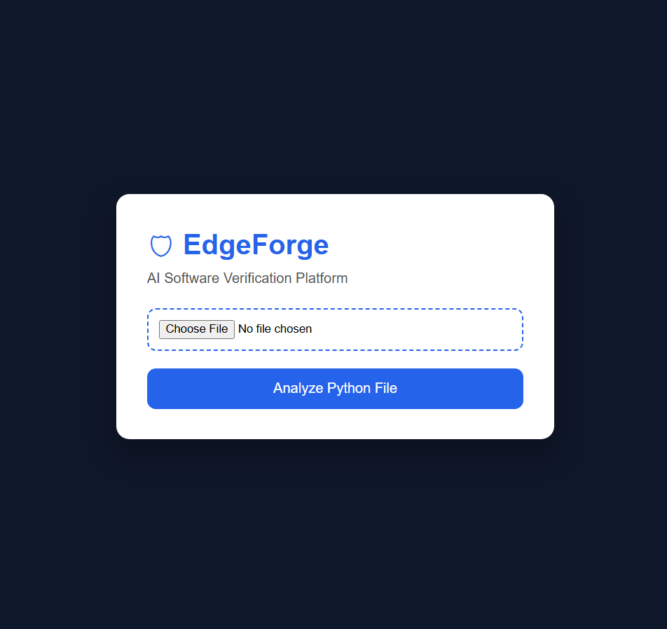
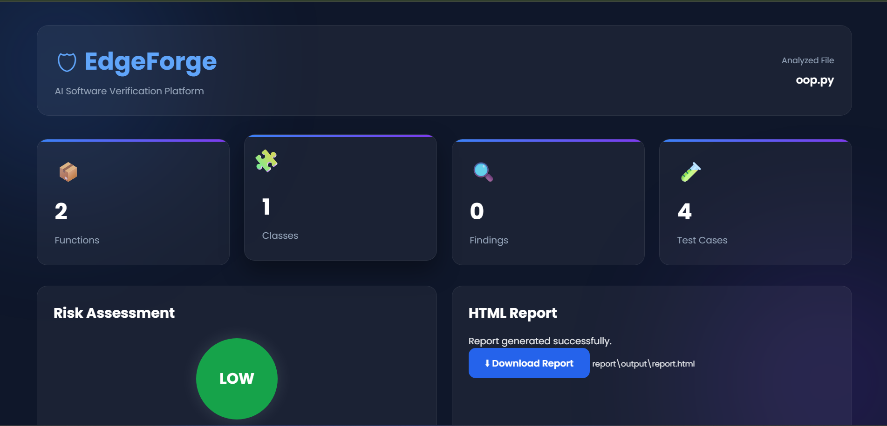
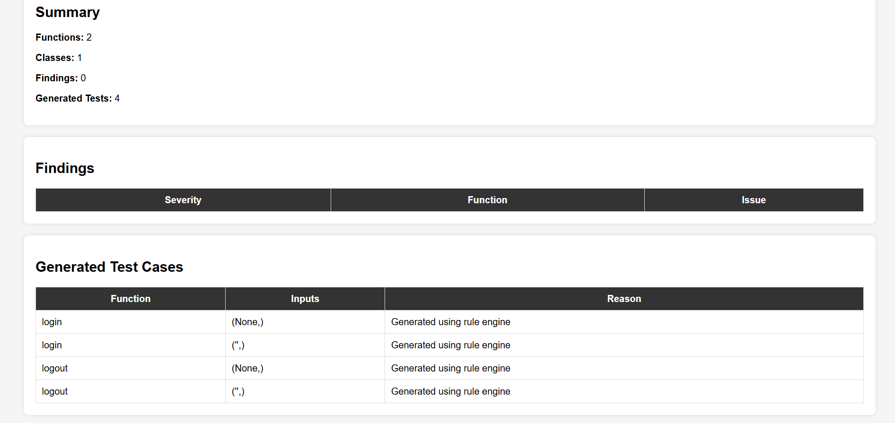
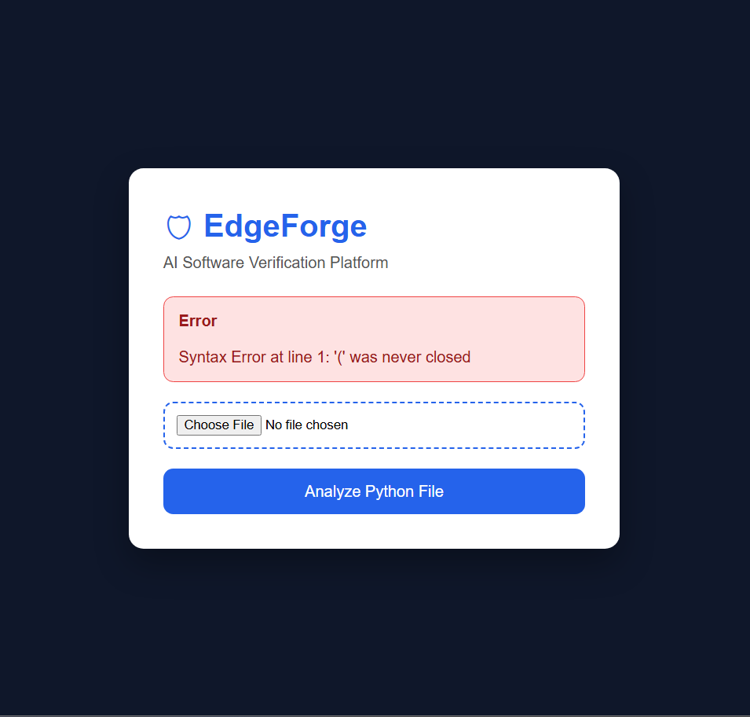

# 🚀 EdgeForge

<div align="center">

### AI-Powered Python Static Analysis & Edge Case Generation Platform

Analyze Python source code, detect potential issues, assess code quality, and automatically generate edge test cases through an intuitive Flask-based web interface.

---


</div>

---

# 📖 Overview

EdgeForge is a Python static analysis platform designed to help developers understand their source code before execution.

Instead of simply running code, EdgeForge parses the Python Abstract Syntax Tree (AST), extracts structural information, analyzes functions and classes, detects potential risks, and generates useful edge-case test scenarios.

The application provides an interactive Flask dashboard where users can upload Python files, view detailed analysis results, inspect generated edge cases, and download an HTML report.

---

# ✨ Features

- ✅ Python AST Parsing
- ✅ Function & Class Detection
- ✅ Parameter Analysis
- ✅ Edge Case Generation
- ✅ Static Code Analysis
- ✅ Risk Assessment
- ✅ HTML Report Generation
- ✅ Downloadable Reports
- ✅ Syntax Error Detection
- ✅ Modern Flask Dashboard
- ✅ Multiple Test File Support
- ✅ Unicode Support
- ✅ Async Function Support
- ✅ Nested Function Detection
- ✅ Object-Oriented Code Analysis

---

# 🏗 Architecture

```
                    +----------------------+
                    |   Python Source File |
                    +----------+-----------+
                               |
                               v
                      +------------------+
                      |   Flask Upload   |
                      +--------+---------+
                               |
                               v
                     +--------------------+
                     |   AST Parser       |
                     +---------+----------+
                               |
             +-----------------+----------------+
             |                                  |
             v                                  v
     +------------------+              +--------------------+
     | Static Analyzer  |              | Edge Generator     |
     +---------+--------+              +---------+----------+
               |                                 |
               +---------------+-----------------+
                               |
                               v
                    +----------------------+
                    | HTML Report Builder  |
                    +----------+-----------+
                               |
                               v
                     +--------------------+
                     | Flask Dashboard    |
                     +--------------------+
```

---

# 📂 Project Structure

```
EdgeForge/
│
├── analyzer/
├── generator/
├── parser_engine/
├── models/
├── report/
├── static/
├── templates/
├── uploads/
├── tests/
├── screenshots/
│
├── app.py
├── main.py
├── requirements.txt
├── README.md
└── .gitignore
```

---

# 🖼 Screenshots

## Home Page



---

## Dashboard



---

## Generated Report



---

## Syntax Error Detection



---

# ⚙ Installation

Clone the repository

```bash
git clone https://github.com/venkateshA-cmd/EdgeForge.git
```

Enter the project directory

```bash
cd EdgeForge
```

Create a virtual environment

```bash
python -m venv venv
```

Activate it

### Windows

```bash
venv\Scripts\activate
```

### Linux / macOS

```bash
source venv/bin/activate
```

Install dependencies

```bash
pip install -r requirements.txt
```

Run the application

```bash
python app.py
```

Open your browser

```
http://127.0.0.1:5000
```